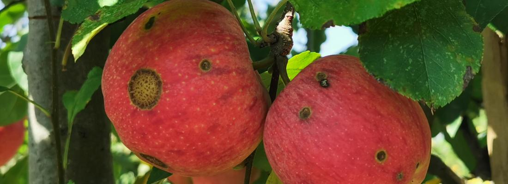

# apple scab resistance prediction using genomic, metabolomic and NIRS (phenomic) data

This repository contains R scripts, for achieving reproducible data analysis and results, according to the FAIR principles defined as follows :

* Findable

* Accessible

* Interoperable

* Reusable